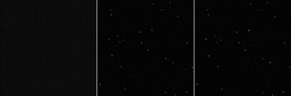
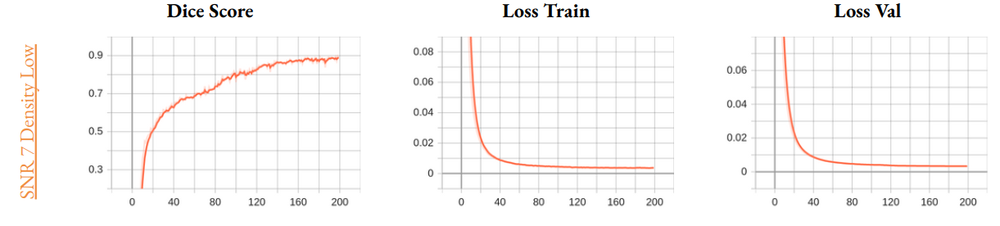
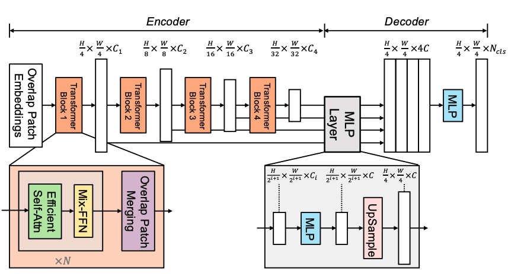
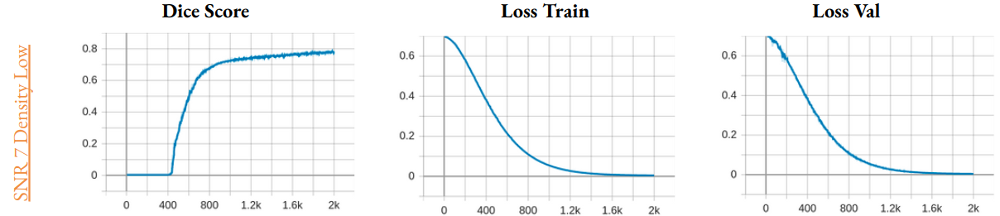
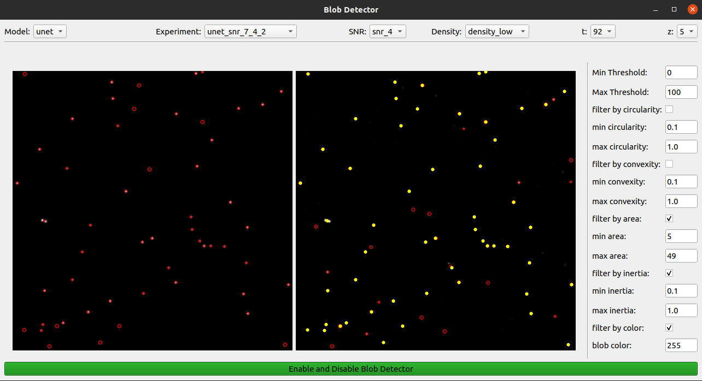

# Segmentation and Detection of Virus Particles

In the field of microscopy, it is very difficult to detect virus particles from a slide because of noise.

In this paper, we propose two segmentation techniques to be able to detect particles in a sequence of 3D images 
taken under a microscope over a period of time.

In the following image, we can see `input | target | prediction`. 

<p align="center">
    
</p>

Directories layout:
```
particle-segmentation-detector
├── BlobDetector
│   ├── blob_detector.py        
│   └── form_blob_detector.py   # qt function
├── Config
│   └── ...
├── docs
│   └── ...
├── Dataset
│   └── ...
├── Experiments
│   └── ...
├── preprocessing
│   ├── analyser.py             
│   ├── creation.py
│   ├── Dataset.py
│   └── segmentation.py   
├── models
│   ├── unet.py						
│   └── vit.py						
├── processing
│   ├── functions.py   # train and val
│   └── utilities.py   # get_loader and checkpointSaver
├── ut
│   ├── ut_analyser.py
│   ├── ut_compute_path.py
│   └── ut_segmenter_creation.py
├──  utils
│   ├── compute_path.py
│   ├── definitions.py		
│   ├── logger.py
│   └── Types.py
├── install_original_dataset.py
├── create_segmented_dataset.py
├── train_model.py
├── requirements.txt
└── README.md
```

## Installation
Make sure you have all the necessary requirements to use this repo.
```
git clone https://github.com/AngeloDamante/particle-segmentation-detector.git
cd particle-segmentation-detector
pip3 install -r requirements.txt
```

## Dataset
The starting datasets for challenge can be found [here](http://www.bioimageanalysis.org/track/).
For your convenience, it can be easily downloaded. 
``` bash
python3 install_original_dataset.py
```
The images are collected in a time sequence where each instant is represented by a microscope shot 
with `(512, 512, 10)` shape.

### Segmentation maps
The segmentation maps are produced synthetically by performing convolution with a three-dimensional 
Gaussian filter with white dots centered in the ground truth extracted from the challenge.
```
python3 create_segmented_dataset.py
# usage: create_segmented_dataset.py [-h] [-K KERNEL] [-S SIGMA]
```
The raw data generated have the structure below:
```
[
    img:np.ndarray,
    target:np.ndarray,
    gth:List[Particle],
    snr:SNR,
    density:Density,
    t:int
]
```
## Train Model with Virus Dataset
[//]: # (inserisci json)


## UNET
unet architecture is widely used for this type of task, 
in this context the crop operation was not performed to preserve as much possible image information.
<p align="center">
    
</p>

```python
from models.unet import UNET
model = UNET(in_channels=10, out_channels=10) 
```

The results obtained by training the network on the snr 7 dataset with low density are shown below
<p align="center">
    
</p>

## SegFormer
The SegFormer is a Visual Transformer with a decoder at the bottom, which is more performant for the segmentation task.

<p align="center">
    
</p>

```python
from models.vit import SegFormer 
model = SegFormer(
            in_channels=10,
            widths=[64, 128, 256, 512],
            depths=[3, 4, 6, 3],
            all_num_heads=[1, 2, 4, 8],
            patch_size=[7, 3, 3, 3],
            overlap_sizes=[4, 2, 2, 2],
            reduction_ratios=[8, 4, 2, 1],
            mlp_expansions=[4, 4, 4, 4],
            decoder_channels=256,
            scale_factors=[8, 4, 2, 1],
            out_channels=10
)
```
The results obtained by training the network on the snr 7 dataset with low density are shown below
<p align="center">
    
</p>

## Blob Detector
In order to use the trained networks, a program was written to allow selection:
- the desired network;
- the `state_dict` of the various trains in `Experiments` directory;
- snr, density, temporal instant and depth of the image on which inference is to be made.

The program also allows the user to set up a raw detector to reveal the correct virus particles and the noise particles.
<p align="center">
    
</p>

[//]: # (inserisci screen del programma)
[//]: # (inserisci 2 esempi delle particelle detectate e rumore)

